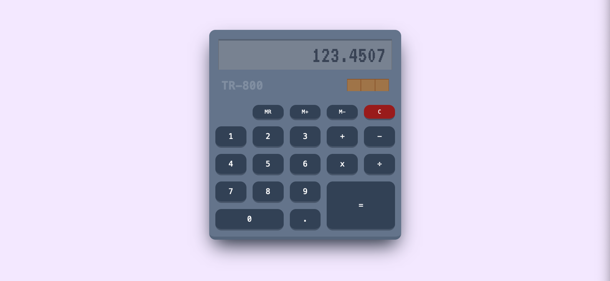

# Calculator

This is a baseline repository for demonstrating CI/CD strategies.
On its own, it's a webapp that provides a simple calculator that is capable of simple arithmetic.

---

## License

MIT-0.

---

[website][website] &middot; [@techlifemusic][twitter]

[twitter]: https://twitter.com/techlifemusic
[website]: https://richardneililagan.com
